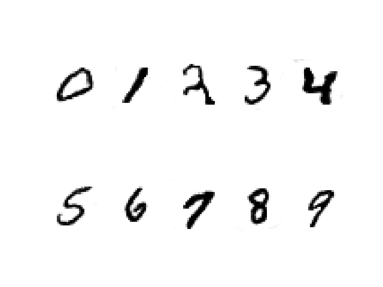
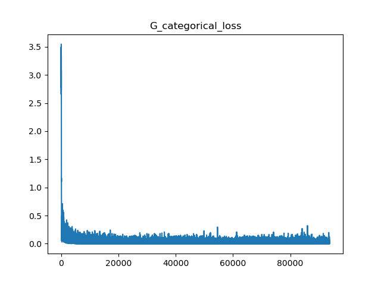
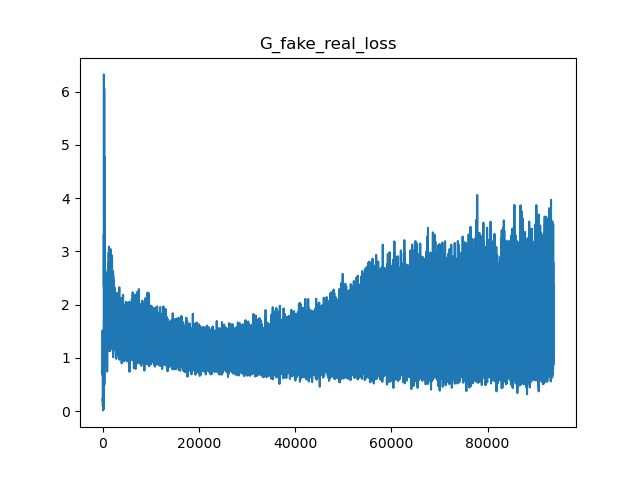

# Auxiliary_GAN_MNIST
# Abstract 
In this project, i implement Auxiliary Classifier GAN, which is an extension of conditional GAN, on the MNIST dataset. Auxiliary Classifier GAN, or AC-GAN for short, is a type of GAN that changes the discriminator to predict the class label of a given image rather than receive it as input. It has the effect of stabilizing the training proces and allowing the generation of large high-quality images whilst learning a representation in the latent space that is independent of the class label.

# Installation 
- keras==2.4.3
- tensorflow==2.4.0
- matplotlib 

# Train 
To train, please run the file acgan.py . During training process, the images generated by model for each epoch would be saved to folder 'images', and the weight of model for each epoch would be saved to folder "saved_model_weights". After training completed, the plot of training history would be saved to folder "plot_history_training".

# Test
For demo, i have trained once and then uploaded weight, generated images and plot of history training into this project. Generated images are stored in folder "images/version1", while weights are stored in folder "saved_model_weights/version1" and training history plots are stored in folder "plot_history_training/version1".
To test the pretrained model, please run file test_acgan.py . This file load the pretrained weight for generator from the file "saved_model_weights/version1/generator_weights_99.0.h5" and then use this generator to generate new images. 

# Demo 
Generated images after training for 100 epochs: 

Generator's categorical loss: 

Generator's binary loss:

# Reference 
Code from this project is based on guideline from this link : https://machinelearningmastery.com/how-to-develop-an-auxiliary-classifier-gan-ac-gan-from-scratch-with-keras/

